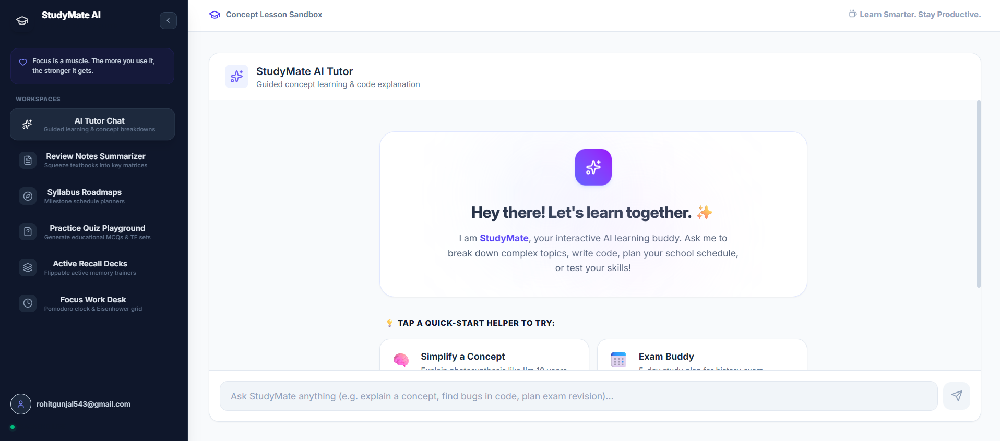

# StudyMate AI 🚀

StudyMate AI is an AI-powered student productivity assistant designed to help students learn smarter, stay organized, and improve focus.

## ✨ Features

- 🤖 AI Tutor Chat
- 📝 Notes Summarizer
- 📚 Quiz Generator
- 🎯 Productivity Workspace
- 📅 Study Roadmaps
- 🌙 Modern Responsive Dashboard

---

## 🛠️ Tech Stack

### Frontend
- ReactJS
- Tailwind CSS
- TypeScript

### AI Integration
- Google Gemini API
- Google AI Studio

### Tools
- GitHub
- Vercel

---

## 📸 Screenshots

---

## 🎯 Future Improvements

- Voice Assistant
- Chat History
- Authentication
- PDF Summarizer
- AI Flashcards
- Mobile Optimization

---

## 👨‍💻 Developer

Built by Rohit using ReactJS and Google Gemini AI.